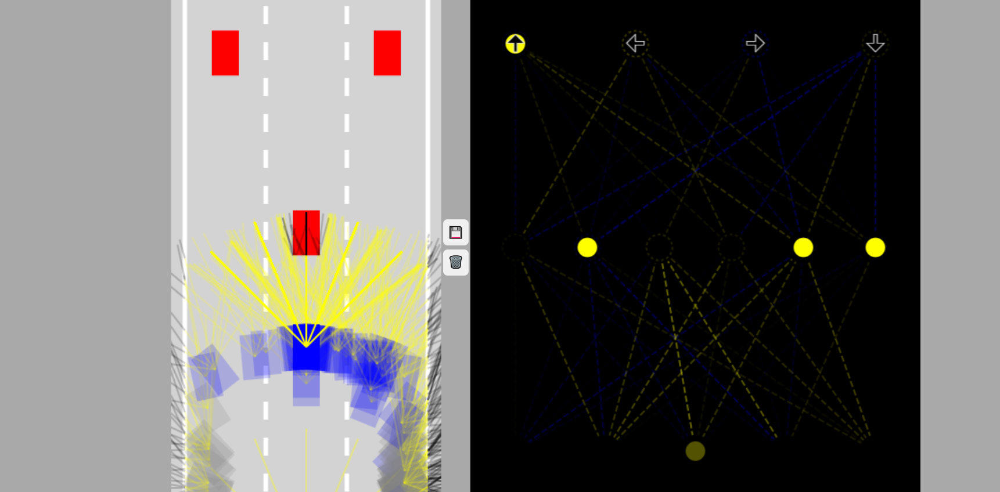

# self_driving car with genetic algorithm

A self driving car implementation in JS vanilla with genetic algorithm and neural network

## Introduction

This project is a simulation of a self-driving car using a genetic algorithm and neural networks, implemented in vanilla JavaScript. It aims to demonstrate how genetic algorithms can be used to evolve neural network parameters for autonomous driving behaviors in a simulated environment.

## Features

- **Simulation Environment**: A custom-built environment for testing and visualizing the self-driving car's behavior.
- **Genetic Algorithm**: Implementation of a genetic algorithm to evolve the car's neural network, improving its driving decisions over generations.
- **Neural Network**: A basic neural network that acts as the car's "brain", making decisions based on sensor inputs.
- **Real-time Visualization**: See how the car makes decisions and improves over time right in your browser.

## Getting Started

To get started with this project, clone this repository and open the `index.html` file in your browser.

````bash
git clone https://github.com/Interesante875/self_driving_car.git
cd self_driving_car

open index.html # or use any web browser to open the file

```bash
````

[](https://youtu.be/jIdZkfzXHnE)
